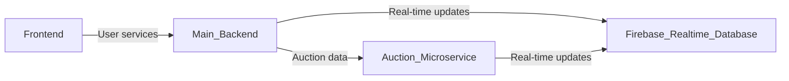
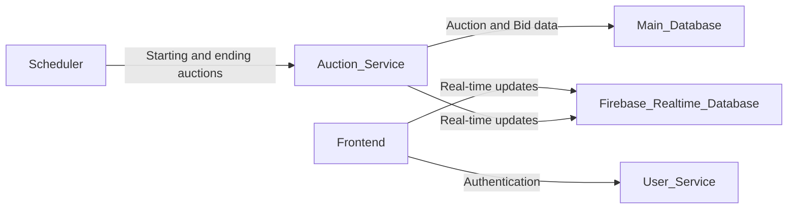

# AuctionFrontend

## Flow Diagram

```mermaid
graph LR
  Frontend-->|User services|Main_Backend
  Main_Backend-->|Auction data|Auction_Microservice
  Main_Backend-->|Real-time updates|Firebase_Realtime_Database
  Auction_Microservice-->|Real-time updates|Firebase_Realtime_Database
```

## Architecture

```mermaid
graph LR
  Frontend-->|Authentication|User_Service
  Frontend-->|Real-time updates|Firebase_Realtime_Database
  Auction_Service-->|Auction and Bid data|Main_Database
  Auction_Service-->|Real-time updates|Firebase_Realtime_Database
  Scheduler-->|Starting and ending auctions|Auction_Service
```
