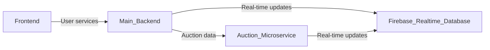
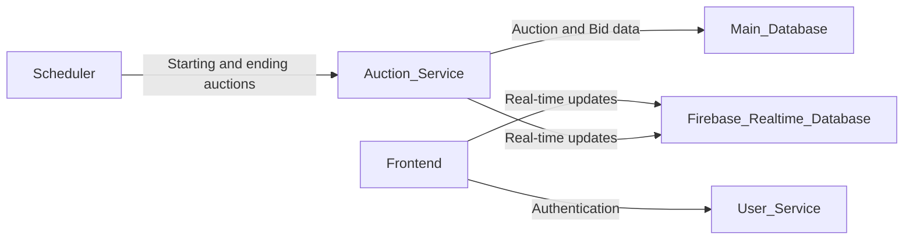
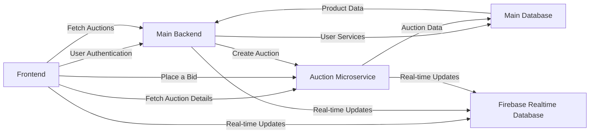

# AuctionFrontend

## Flow Diagram

```mermaid
graph LR
  Frontend-->|User services|Main_Backend
  Main_Backend-->|Auction data|Auction_Microservice
  Main_Backend-->|Real-time updates|Firebase_Realtime_Database
  Auction_Microservice-->|Real-time updates|Firebase_Realtime_Database
```

## Architecture

```mermaid
graph LR
  Frontend-->|Authentication|User_Service
  Frontend-->|Real-time updates|Firebase_Realtime_Database
  Auction_Service-->|Auction and Bid data|Main_Database
  Auction_Service-->|Real-time updates|Firebase_Realtime_Database
  Scheduler-->|Starting and ending auctions|Auction_Service
```

## new

```mermaid
graph LR
A[Frontend]
B[Main Backend]
C[Auction Microservice]
D[Firebase Realtime Database]
E[Main Database]

A -- User Authentication --> B
A -- Fetch Auctions --> B
A -- Fetch Auction Details --> C
A -- Place a Bid --> C
A -- Real-time Updates --> D

B -- Create Auction --> C
B -- User Services --> E
B -- Real-time Updates --> D

C -- Auction Data --> E
C -- Real-time Updates --> D

E -- Product Data --> B

```
