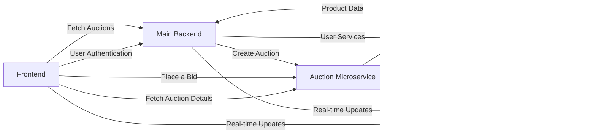

# AuctionFrontend

## Flow Diagram

## Architecture

## Detailed architecture
This diagram represents the following:

    1. The frontend communicates with the Main Backend for user authentication and fetching auctions.
    2. The frontend communicates with the Auction Microservice for fetching specific auction details and placing a bid.
    3. The frontend receives real-time updates from the Firebase Realtime Database.
    4. The Main Backend communicates with the Auction Microservice to create an auction.
    5. The Main Backend uses user services data from the Main Database.
    6. The Main Backend sends real-time updates to the Firebase Realtime Database.
    7. The Auction Microservice sends auction data to the Main Database and real-time updates to the Firebase Realtime Database.
    8. The Main Database sends product data to the Main Backend.

